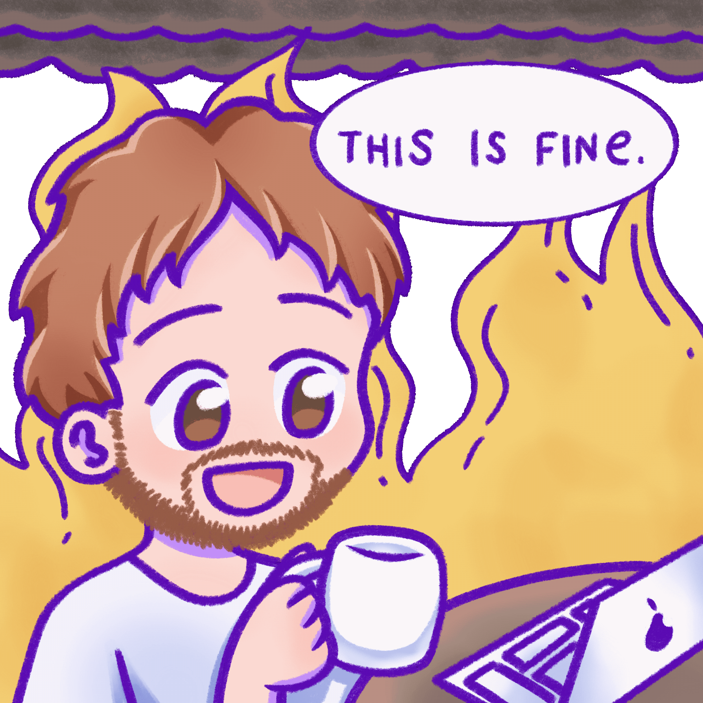

### Welcome to my GitHub profile!

I'm Eduardo, a software developer from Brazil. 
Computer and Electronic Engineer at [UFRJ](https://ufrj.br/). 
Currently working as a mobile developer. 

[Flutter](https://flutter.dev/) enthusiast and always trying to learn more. 
Recently doing a few online courses on Machine and Deep learning at [Coursera](http://coursera.org/).

My current repo's are all small-scale Flutter projects, which serve as both a proof-of-concept and continuous training. 
Even though they are small, I have plans to improve them in the future. Stay tuned. 
I know I _will_ have time someday. I hope so. 😅  
Translating my repo's Readme's is a work in progress. 

You can reach me at: 

 

%20reputation%3A)

<!--
**naslausky/naslausky** is a ✨ _special_ ✨ repository because its `README.md` (this file) appears on your GitHub profile.

Here are some ideas to get you started:

- 🔭 I’m currently working on ...
- 🌱 I’m currently learning ...
- 👯 I’m looking to collaborate on ...
- 🤔 I’m looking for help with ...
- 💬 Ask me about ...
- 📫 How to reach me: ...
- 😄 Pronouns: ...
- ⚡ Fun fact: ...
-->
